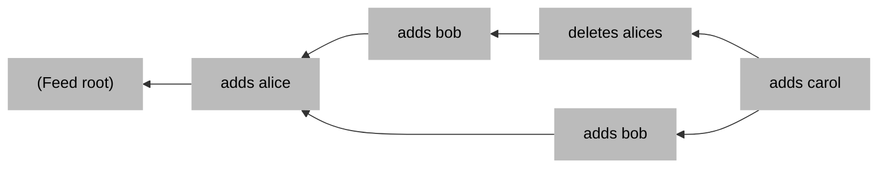
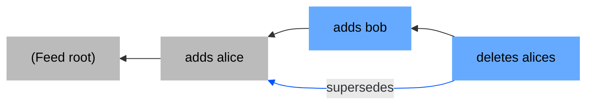
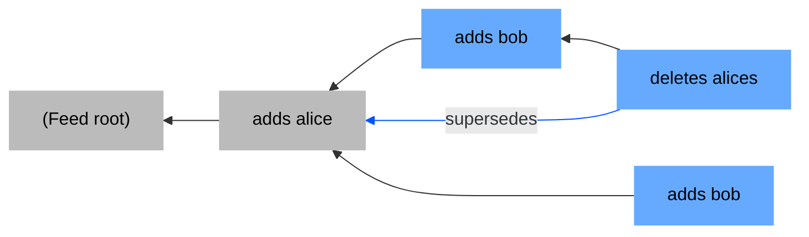
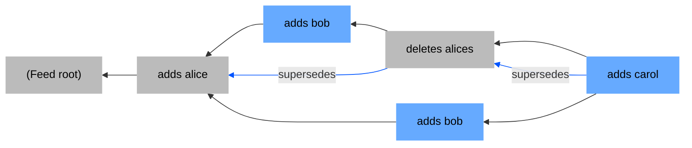

## Feed tangle

(Lipmaa backlinks are not shown in the diagram below, but they should exist)



Reducing the tangle above in a topological sort allows you to build an array
(a JSON object) `[bob, carol]`.

## Msg type

`msg.metadata.type` MUST start with `set_v1__`. E.g. `set_v1__follows`.

## Msg content

`msg.content` format:

```typescript
interface MsgContent {
  add: Array<string>,
  del: Array<string>,
  supersedes: Array<MsgHash>,
}
```

## Supersedes links

When you add or delete an item in a set, in the `supersedes` array you MUST
point to the currently-known highest-depth msg that added or deleted that item.

Also, when you *add any item*, in the `supersedes` array you SHOULD point to
all currently-known highest-depth msgs that *deleted something*.

The set of *not-transitively-superseded-by-anyone* msgs comprise the
"item roots" of the record. To allow pruning the tangle, we can delete
(or, if we want to keep metadata, "erase") all msgs preceding the item roots.

Suppose the tangle is grown in the order below, then the field roots are
highlighted in blue.


-----


-----



-----



-----


